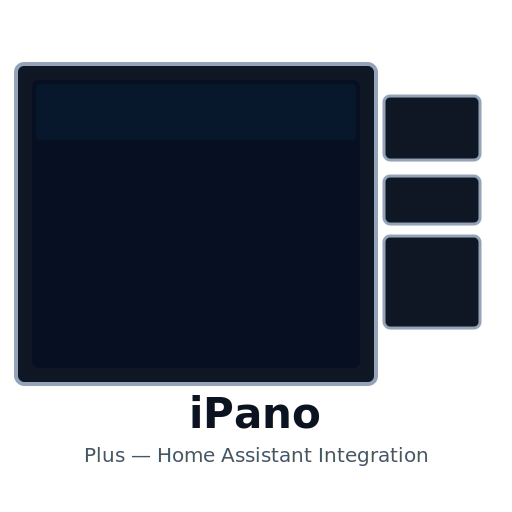

  

---
# iPano Plus Home Assistant Integration

A Home Assistant integration that adds support for 6‑inch iPano Plus in‑wall touchscreen panels — exposes buttons, backlights, relays and proximity sensor. Install via HACS (recommended) or manually by copying `custom_components/ipano_plus/`.

Quick install:
- HACS → Integrations → Add custom repository → Enter `https://github.com/Cominew/ipano-plus-homeassistant` (Integration)

See full documentation in the repository README or docs/README.md.